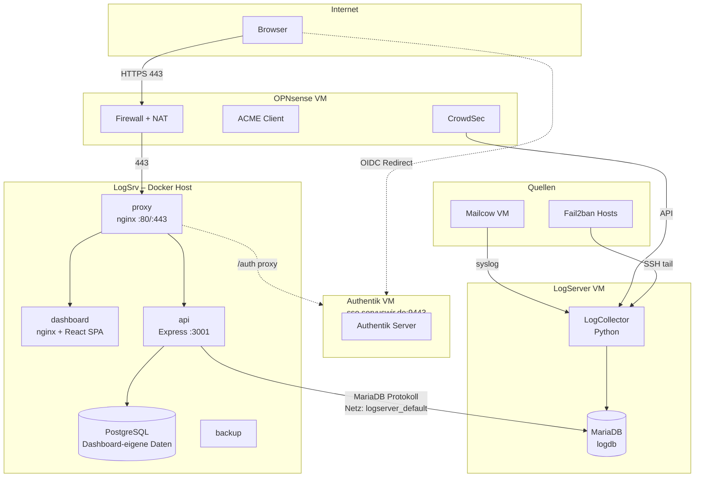
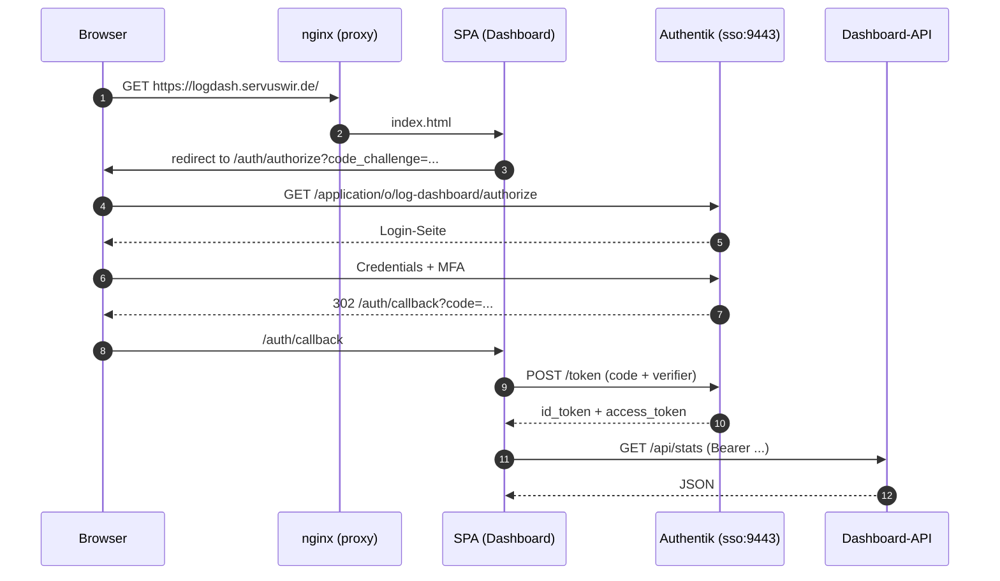

# 01 – Gesamtarchitektur

## 1.1 Datenfluss-Sicht

So fließen die Logs von den Quellen bis ins Dashboard:

```text
┌─────────────┐   ┌─────────────┐   ┌─────────────┐
│  Mailcow    │   │  OPNsense   │   │  Fail2ban   │
│ Postfix/    │   │  + CrowdSec │   │  Jails      │
│ Dovecot/    │   │             │   │             │
│ nginx       │   │             │   │             │
└──────┬──────┘   └──────┬──────┘   └──────┬──────┘
       │ syslog/         │ API/log         │ logs
       ▼                 ▼                 ▼
      ┌───────────────────────────────────────┐
      │   LogCollector (Python)               │
      │   - Parser (pro Quelle)               │
      │   - Normalizer                        │
      │   - Enricher (GeoIP/ASN)              │
      │   - Risk-Scorer                       │
      └──────────────┬────────────────────────┘
                     ▼
            ┌─────────────────┐
            │  MariaDB logdb  │
            │  - security_events
            │  - auth_events
            │  - ip_summary
            │  - ip_enrichment
            │  - ip_risk_score│
            └────────┬────────┘
                     ▼
            ┌─────────────────┐
            │  Dashboard API  │
            │  (Express)      │
            └────────┬────────┘
                     ▼
            ┌─────────────────┐
            │  React UI       │
            │  (Dashboard)    │
            └─────────────────┘
```

> Der LogCollector schreibt normalisierte Events nach MariaDB. Periodische Jobs (IP-Enricher, Risk-Score, IP-Summary) lassen sich unter **Tools** im Dashboard manuell anstoßen. Das Dashboard liest **ausschließlich** über die Express-API – keine Direktverbindung zur Datenbank.

## 1.2 Infrastruktur-Sicht (VMs & Container)



**Container auf LogSrv** (`/opt/dashboard/deploy/docker-compose.yml`):

| Container | Image | Port | Zweck |
|-----------|-------|------|-------|
| `proxy` | nginx:1.27 | 80, 443 (host) | TLS-Terminierung, Reverse-Proxy |
| `dashboard` | self-built | 80 (intern) | React-SPA via nginx |
| `api` | self-built (Node) | 3001 (host: 127.0.0.1) | Express-API zu MariaDB |
| `db` | postgres:16 | – | Eigene Daten des Dashboards |
| `backup` | alpine:3.20 | – | Cron, schreibt nach `${BACKUP_PATH}` |

**Externes Docker-Netz** `logserver_default`: brückt den `api`-Container zum MariaDB-Container `logserver-db`.

## 1.3 Auth-Flow (OIDC mit PKCE)



## 1.4 Verantwortlichkeiten pro Komponente

| Komponente | Zweck | Schreibt nach | Liest von | VM |
|------------|-------|---------------|-----------|-----|
| Mailcow | Mail-Stack | syslog | – | Mailcow-VM |
| OPNsense | Firewall, NAT, ACME | Logs, API | – | OPNsense-VM |
| CrowdSec | IPS | LAPI | OPNsense-Logs | OPNsense-VM |
| Fail2ban | Auth-Schutz | `/var/log/fail2ban.log` | syslog | je Host |
| LogCollector | Parsen + Normalisieren | MariaDB `logdb` | alle Quellen | LogServer-VM |
| MariaDB `logdb` | Persistenz | – | – | LogServer-VM |
| Authentik | OIDC/SSO | eigene DB | – | Authentik-VM |
| Dashboard-API | REST-API | PostgreSQL | MariaDB `logdb` | LogSrv (Docker) |
| Dashboard-SPA | UI | – | Dashboard-API | LogSrv (Docker) |
| nginx-proxy | TLS + Routing | – | – | LogSrv (Docker) |

## 1.5 Trennung der Belange

- **LogCollector** (separate VM/Repo): Ingestion + Normalisierung + Enrichment.
- **Dashboard** (dieses Repo): nur Visualisierung + manuelles Triggern von Jobs.
- **Authentik** (separate VM): SSO/OIDC, kein direkter App-Zugriff auf User-DB.
- **OPNsense**: Netzwerk-Edge + CrowdSec-Quelle, eigener API-Zugang nur Read-Only.

## 1.6 Daten-Quellen-Tabelle

| Quelle | Transport | Format | Frequenz | Ziel-Tabelle |
|--------|-----------|--------|----------|--------------|
| Mailcow | syslog (UDP 514) | raw text | kontinuierlich | `auth_events`, `security_events` |
| OPNsense API | HTTPS REST | JSON | 60 s Polling | `security_events` |
| CrowdSec LAPI | HTTPS REST | JSON | 60 s Polling | `security_events` |
| Fail2ban | SSH `tail` | text | 30 s | `auth_events` |
| Remote-Hosts | SSH `tail` | text | 30 s | `auth_events` |

## 1.7 Netz- und Port-Übersicht

| Port | Protokoll | Quelle → Ziel | Zweck |
|------|-----------|---------------|-------|
| 80/tcp | HTTP | Internet → OPNsense → LogSrv | ACME-HTTP-01 + Redirect |
| 443/tcp | HTTPS | Internet → OPNsense → LogSrv | Dashboard |
| 9443/tcp | HTTPS | Internet → OPNsense → Authentik-VM | SSO-Login |
| 3001/tcp | HTTP | nur 127.0.0.1 LogSrv | API (intern) |
| 3306/tcp | MariaDB | api-Container → logserver-db | Logs lesen |
| 514/udp | syslog | Mailcow → LogServer-VM | Mail-Logs |
| 8081/tcp | HTTP | api-Container → OPNsense | CrowdSec LAPI |
| 22/tcp | SSH | api-Container → Remote-Hosts | Log-Abholung |
