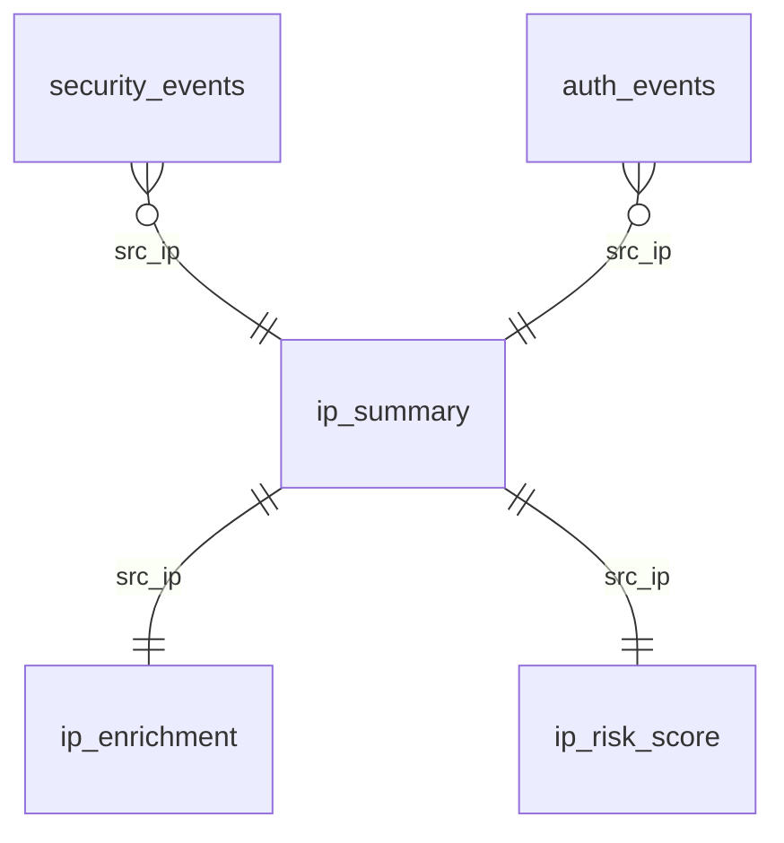

# 10 – Datenbank-Schema (MariaDB `logdb`)

> Die MariaDB liegt auf der **LogServer-VM** im Container `logserver-db`. Der Dashboard-API-Container greift read-only zu.

## 10.1 ER-Übersicht



## 10.2 Tabellen

### `security_events`

| Spalte | Typ | Index | Beschreibung |
|--------|-----|-------|--------------|
| `id` | BIGINT PK AUTO | – | |
| `ts` | DATETIME(3) | idx | Event-Zeitpunkt |
| `source` | VARCHAR(32) | idx | `opnsense`, `crowdsec`, … |
| `type` | VARCHAR(64) | idx | `alert`, `ban`, `block` |
| `src_ip` | VARCHAR(45) | idx | IPv4/IPv6 |
| `dst_ip` | VARCHAR(45) | – | |
| `severity` | ENUM | idx | low/medium/high/critical |
| `raw` | TEXT | – | Original-Log-Zeile |

### `auth_events`

| Spalte | Typ | Index |
|--------|-----|-------|
| `id` | BIGINT PK AUTO | – |
| `ts` | DATETIME(3) | idx |
| `source` | VARCHAR(32) | idx |
| `type` | VARCHAR(32) | idx (`success`/`failure`) |
| `src_ip` | VARCHAR(45) | idx |
| `user` | VARCHAR(255) | idx |
| `service` | VARCHAR(64) | idx (ssh, smtp, imap, …) |
| `raw` | TEXT | – |

### `ip_summary` (aggregiert)

| Spalte | Typ |
|--------|-----|
| `src_ip` | VARCHAR(45) PK |
| `first_seen` | DATETIME |
| `last_seen` | DATETIME |
| `total_events` | INT |
| `auth_failures_24h` | INT |
| `bans_24h` | INT |

### `ip_enrichment`

| Spalte | Typ |
|--------|-----|
| `src_ip` | VARCHAR(45) PK |
| `country` | CHAR(2) |
| `asn` | INT |
| `asn_org` | VARCHAR(255) |
| `reverse_dns` | VARCHAR(255) |
| `enriched_at` | DATETIME |

### `ip_risk_score`

| Spalte | Typ |
|--------|-----|
| `src_ip` | VARCHAR(45) PK |
| `score` | TINYINT (0–100) |
| `reason` | JSON |
| `computed_at` | DATETIME |

## 10.3 Empfohlene Indizes (Performance)

```sql
CREATE INDEX idx_secevt_ts_ip ON security_events (ts, src_ip);
CREATE INDEX idx_authevt_ts_ip ON auth_events (ts, src_ip);
CREATE INDEX idx_authevt_user_ts ON auth_events (user, ts);
```

## 10.4 Retention

Empfohlene Aufbewahrung:

| Tabelle | Retention | Methode |
|---------|-----------|---------|
| `security_events` | 90 Tage | monatliche Partitionen + `DROP PARTITION` |
| `auth_events` | 90 Tage | dito |
| `ip_summary` | unbegrenzt (klein) | – |
| `ip_enrichment` | 30 Tage Cache | `enriched_at < NOW()-30d` löschen |
| `ip_risk_score` | aktueller Stand | überschreiben |

Beispiel-Partitionierung:

```sql
ALTER TABLE security_events
PARTITION BY RANGE (TO_DAYS(ts)) (
  PARTITION p202605 VALUES LESS THAN (TO_DAYS('2026-06-01')),
  PARTITION p202606 VALUES LESS THAN (TO_DAYS('2026-07-01')),
  PARTITION pmax    VALUES LESS THAN MAXVALUE
);
```

## 10.5 Read-only User für Dashboard

```sql
CREATE USER 'loguser'@'%' IDENTIFIED BY '<MARIADB_PW>';
GRANT SELECT ON logdb.* TO 'loguser'@'%';
FLUSH PRIVILEGES;
```
